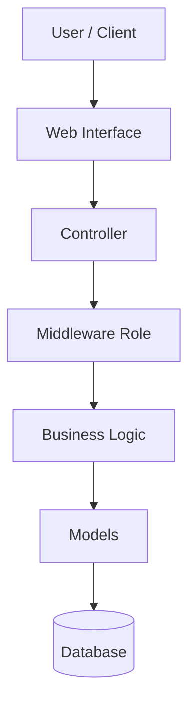

# Arsitektur Enterprise

## 1. Latar Belakang
Sistem SDM ini dikembangkan sebagai aplikasi web enterprise berbasis Laravel dengan pendekatan role-based access control. Sistem dirancang untuk mendukung kebutuhan pengelolaan akun, data pegawai, profil akademik, serta akses dashboard yang berbeda sesuai peran pengguna.

## Kapabilitas operasional terbaru

- **Backup data:** Super Admin dapat mengunduh arsip ZIP berisi snapshot JSON tabel users, employees, announcements, specializations, employee_documents, dan activity_logs. Arsip memiliki manifest waktu pembuatan dan tidak dapat diakses role lain.
- **Audit aktivitas:** seluruh request terautentikasi dengan nama route dicatat ke `activity_logs` (user, aksi, metode, IP, waktu). Super Admin dapat meninjau log berhalaman.
- **Self-service dashboard:** pegawai memperbarui profil dan dokumennya sendiri; pencarian pegawai dilakukan berdasarkan akun login (email/login_id/nama), bukan ID dari URL.
- **Read-only Direksi:** middleware role membatasi route manipulasi; menu Direksi hanya menyediakan ringkasan dan direktori pemantauan.

Alur proses utama: Login → middleware autentikasi/role → dashboard sesuai role → self-service atau monitoring → pencatatan audit. Backup berjalan sebagai alur terpisah yang hanya dipanggil Super Admin dan menghasilkan artefak unduhan terproteksi.

## 2. Tujuan Arsitektur Enterprise
- Menyediakan struktur sistem yang terorganisir dan mudah dikembangkan.
- Memisahkan peran pengguna berdasarkan hak akses.
- Memungkinkan integrasi dan pemeliharaan data SDM secara konsisten.
- Menyediakan fondasi yang siap untuk ekspansi ke modul lain di masa depan.

## 3. Komponen Arsitektur

### 3.1 Layer Presentasi
Layer ini mencakup antarmuka pengguna yang dibangun dengan:
- Laravel Blade
- Layout utama
- Sidebar dinamis berdasarkan role
- Dashboard khusus per role

### 3.2 Layer Aplikasi
Layer ini berisi logika bisnis utama, seperti:
- Otentikasi pengguna
- Middleware role
- Controller untuk dashboard dan manajemen data
- Validasi akses halaman berdasarkan role

### 3.3 Layer Data
Layer ini menangani penyimpanan dan pengelolaan data melalui:
- Database relasional MySQL
- Model Eloquent
- Migration untuk skema tabel
- Relasi data pengguna, karyawan, dan spesialisasi

## 4. Arsitektur Fungsional

## 5. Arsitektur Peran (Role-Based Architecture)
Sistem menerapkan akses berbasis role dengan pembagian sebagai berikut:
- Super Admin: mengelola akun, data karyawan, data pengajar, dan spesialisasi
- Direksi: melihat data secara read-only untuk monitoring organisasi
- Karyawan: melihat dan mengedit profil pribadi
- Pengajar: melihat dan mengedit profil akademik
- Karyawan & Pengajar: mengakses fitur gabungan dari kedua peran

## 6. Kriteria Arsitektur Enterprise
- Modular
- Aman
- Skalabel
- Mudah dipelihara
- Sesuai kebutuhan organisasi

## 7. Keunggulan Arsitektur yang Digunakan
- Penggunaan framework Laravel mempercepat pengembangan.
- Middleware mempermudah kontrol akses.
- Struktur MVC memisahkan logic, view, dan data.
- Dashboard yang berbeda memudahkan pengalaman pengguna sesuai kebutuhan peran.

## 8. Kesimpulan
Arsitektur enterprise sistem SDM ini dirancang agar aplikasi dapat berkembang menjadi sistem manajemen sumber daya manusia yang lebih luas, aman, dan terstruktur.
