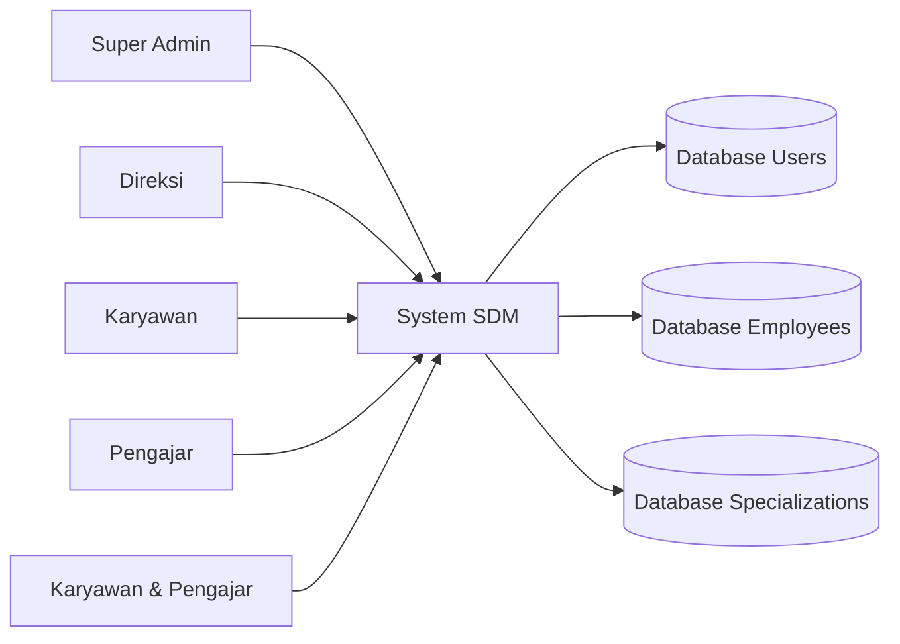
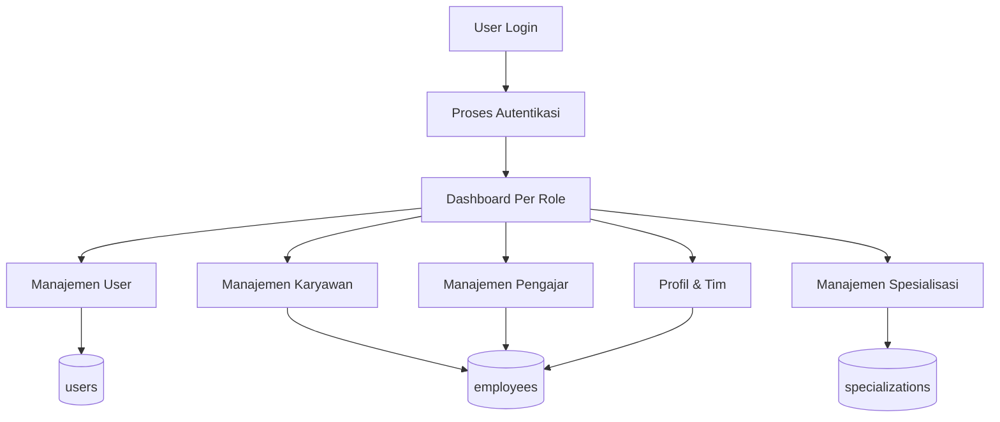

# DFD (Data Flow Diagram)

## DFD Level 0

## DFD Level 1

## Penjelasan Alur
- Pengguna melakukan login terlebih dahulu.
- Sistem memvalidasi role pengguna.
- Setelah login, sistem menampilkan dashboard sesuai role.
- Setiap role memiliki aliran data yang berbeda, seperti manajemen user untuk admin, akses read-only untuk direksi, dan pengeditan profil untuk karyawan atau pengajar.
- Request user terautentikasi mengalir ke proses Audit Aktivitas dan disimpan pada `activity_logs`.
- Super Admin menjalankan proses Backup yang membaca snapshot tabel inti dan menghasilkan arsip ZIP.
