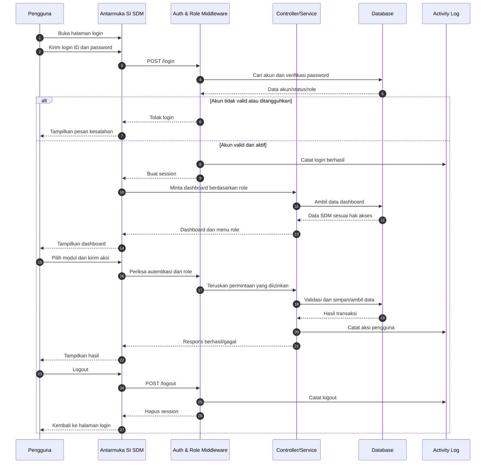
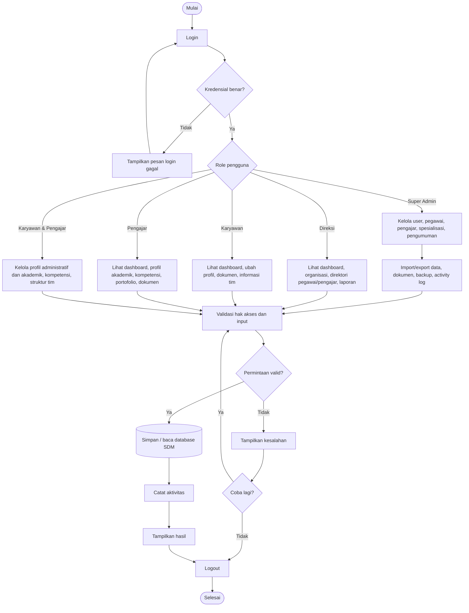

# Diagram Sistem Informasi SDM

Dokumen ini memuat activity diagram, sequence diagram, dan flowchart utama Sistem Informasi SDM. Diagram menggunakan Mermaid.

## 1. Activity Diagram (Swimlane)

```mermaid
flowchart LR
    subgraph U[Pengguna]
        A((Mulai)) --> B[Buka halaman login]
        B --> C[Masukkan login ID dan password]
        C --> D{Kirim kredensial}
        M[Pilih menu sesuai hak akses]
        N[Isi atau ubah data]
        O[Logout]
        P((Selesai))
    end

    subgraph S[Sistem Informasi SDM]
        E[Validasi format dan kredensial]
        F{Akun valid dan aktif?}
        G[Ambil role pengguna]
        H[Arahkan ke dashboard sesuai role]
        I[Tampilkan dashboard dan menu]
        J[Validasi input dan hak akses]
        K{Data valid?}
        L[Simpan perubahan / proses permintaan]
        Q[Tampilkan pesan berhasil atau gagal]
        R[Hapus sesi login]
    end

    subgraph DBASE[(Database / Audit)]
        T[(Users, Employees, Documents, Payroll, Competencies)]
        V[(Activity Logs)]
    end

    D --> E --> F
    F -- "Tidak" --> Q --> B
    F -- "Ya" --> G --> H --> I --> M
    M --> N --> J --> K
    K -- "Tidak" --> Q --> N
    K -- "Ya" --> L --> T
    L --> V --> Q --> M
    M --> O --> R --> V --> P
```

## 2. Sequence Diagram (Swimlane)



## 3. Flowchart Sistem Informasi SDM



### Keterangan

- Swimlane activity diagram memisahkan tanggung jawab pengguna, aplikasi, dan penyimpanan data/audit.
- Sequence diagram menunjukkan proses autentikasi, pengarahan berdasarkan role, transaksi modul, pencatatan log, dan logout.
- Flowchart menunjukkan percabangan utama berdasarkan role yang tersedia pada aplikasi.
