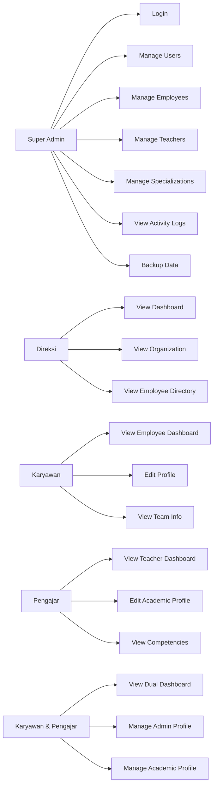
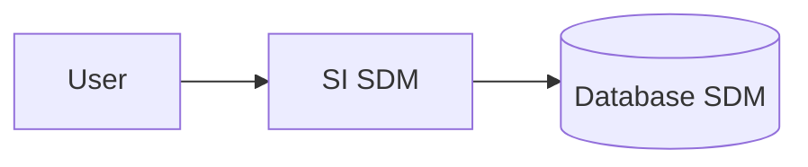
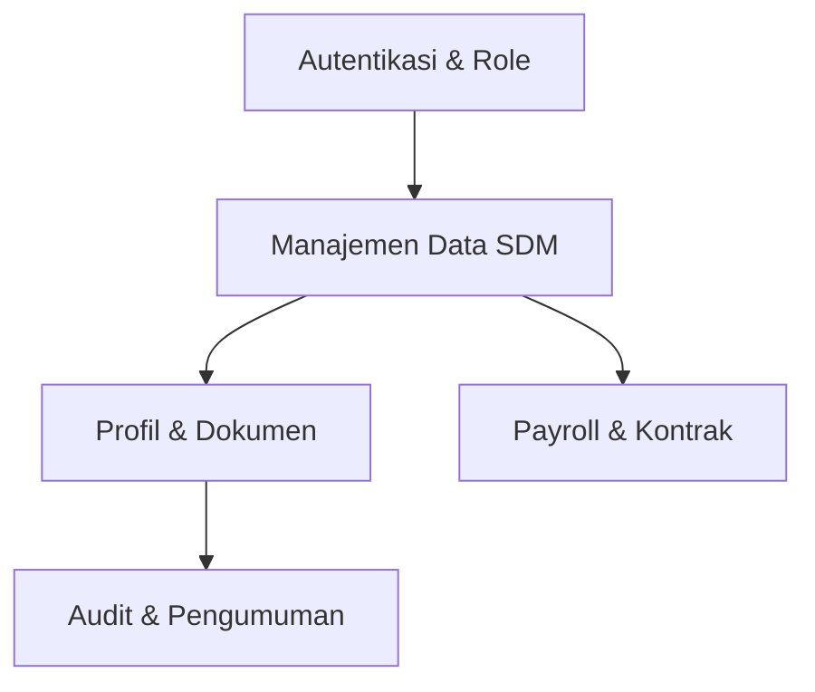
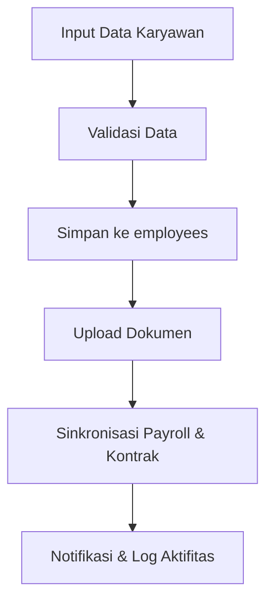
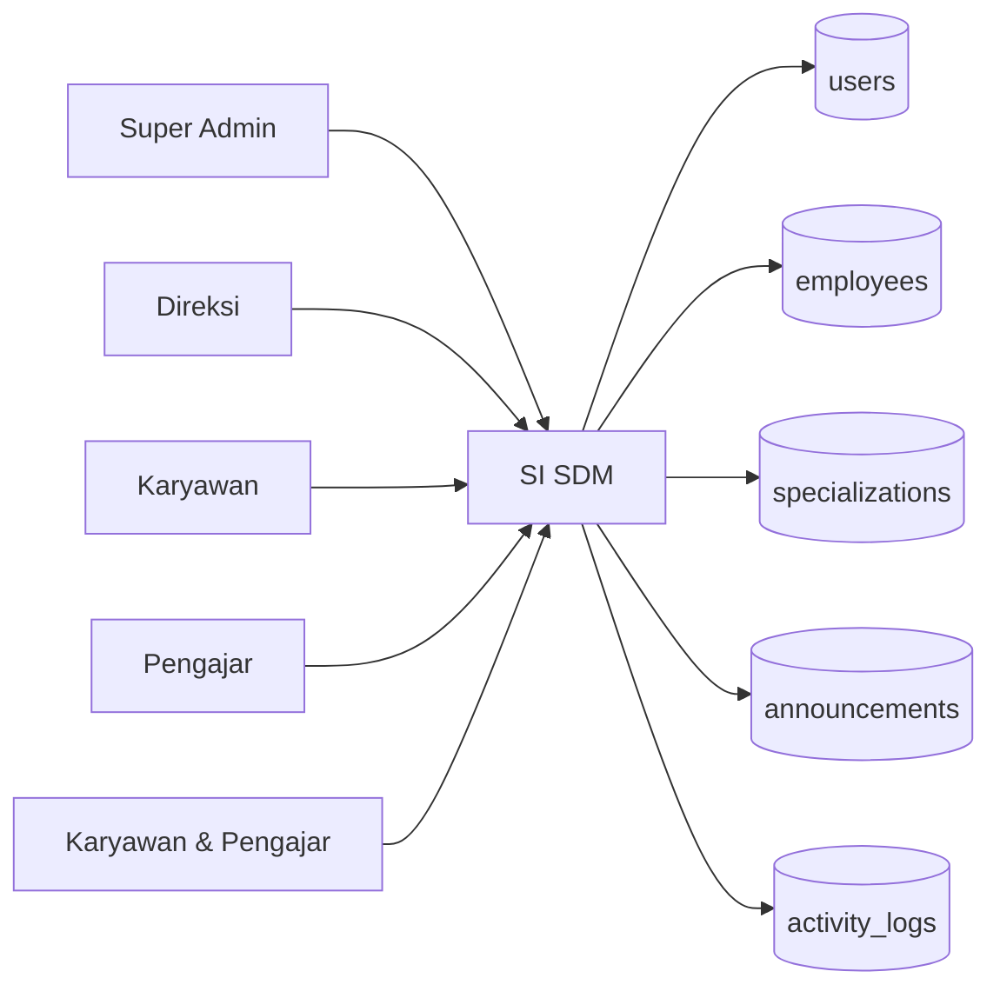
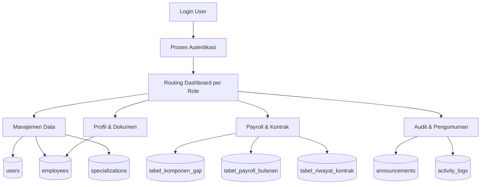

# Dokumentasi Final Sistem SDM

## 1. Gambaran Umum
Sistem SDM ini adalah aplikasi web berbasis Laravel yang menangani:
- autentikasi dan manajemen akun berbasis role,
- data karyawan dan pengajar,
- spesialisasi/kompetensi,
- dokumen karyawan,
- payroll dan riwayat kontrak,
- pengumuman, log aktivitas, dan backup data.

## 2. ERD Final dan Relasinya

### ERD Final
```mermaid
erDiagram
    USERS ||--o{ SESSIONS : has
    USERS ||--o{ PASSWORD_RESET_TOKENS : receives
    USERS ||--o{ ANNOUNCr EMENTS : creates
    USERS ||--o{ ACTIVITY_LOGS : performs
    USERS ||--o| EMPLOYEES : has_profile

    EMPLOYEES ||--o{ TABEL_DOKUMEN_KARYAWAN : owns
    EMPLOYEES ||--o| TABEL_KOMPONEN_GAJI : has
    EMPLOYEES ||--o{ TABEL_PAYROLL_BULANAN : receives
    EMPLOYEES ||--o{ TABEL_RIWAYAT_KONTRAK : has
    EMPLOYEES ||--o{ TABEL_SPESIALISASI_PENGAJAR : has

    USERS {
        bigint id PK
        string login_id UK
        string name
        string email UK
        string password
        string role
        string status_akun
        json biodata
        timestamp created_at
        timestamp updated_at
    }

    EMPLOYEES {
        bigint id PK
        string nama
        string nip UK
        enum peran
        string email UK
        string telepon
        text alamat
        string ktp
        string kk
        enum status_aktif
        string jabatan_divisi
        string id_atasan
        string divisi_akademik
        string kampus_asal
        date tanggal_masuk
        date tanggal_keluar
        enum gol_darah
        enum status_pernikahan
        string dokumen_pelatihan
        string nomor_sertifikat
        timestamp created_at
        timestamp updated_at
    }

    SPECIALIZATIONS {
        bigint id PK
        string name UK
        text description
        timestamp created_at
        timestamp updated_at
    }

    ANNOUNCEMENTS {
        bigint id PK
        string title
        text content
        string target_role
        timestamp published_at
        bigint created_by FK
        timestamp created_at
        timestamp updated_at
    }

    ACTIVITY_LOGS {
        bigint id PK
        bigint user_id FK
        string action
        string route
        string method
        string ip_address
        text description
        timestamp created_at
        timestamp updated_at
    }

    SESSIONS {
        string id PK
        bigint user_id FK
        string ip_address
        text user_agent
        longtext payload
        int last_activity
    }

    PASSWORD_RESET_TOKENS {
        string email PK
        string token
        timestamp created_at
    }

    TABEL_DOKUMEN_KARYAWAN {
        int id_dokumen PK
        string nip_pemilik FK
        enum jenis_dokumen
        string nama_file_path
        timestamp tanggal_upload
    }

    TABEL_KOMPONEN_GAJI {
        int id_komponen PK
        string nip_pegawai FK
        decimal gaji_pokok
        decimal total_tunjangan_rutin
        timestamp tanggal_update
    }

    TABEL_PAYROLL_BULANAN {
        int id_payroll PK
        string nip_pegawai FK
        string no_slip UK
        string bulan_tahun
        decimal gaji_pokok_history
        decimal tunjangan_history
        decimal bonus_closing
        decimal thr
        decimal bonus_akhir_tahun
        decimal total_gaji_clean
        datetime tanggal_transfer
        enum status_pembayaran
    }

    TABEL_RIWAYAT_KONTRAK {
        int id_kontrak PK
        string nip_pegawai FK
        enum tipe_kontrak
        date tanggal_mulai
        date tanggal_selesai
        text keterangan
    }

    TABEL_SPESIALISASI_PENGAJAR {
        int id_spesialisasi PK
        string nip_pengajar FK
        string nama_keahlian
    }
```

### Relasi Utama
- Satu user dapat memiliki banyak sesi login.
- Satu user dapat menerima banyak token reset password.
- Satu user dapat membuat banyak pengumuman.
- Satu user dapat melakukan banyak aktivitas log.
- Satu employee dapat memiliki banyak dokumen.
- Satu employee memiliki satu komponen gaji.
- Satu employee dapat memiliki banyak payroll bulanan.
- Satu employee dapat memiliki banyak riwayat kontrak.
- Satu employee dapat memiliki banyak spesialisasi pengajar.
- Relasi antara users dan employees bersifat logis/opsional karena belum semua migrasi menerapkan foreign key langsung.

## 3. Use Case

### Aktor
- Super Admin
- Direksi
- Karyawan
- Pengajar
- Karyawan & Pengajar

### Use Case Utama


## 4. Diagram Level 1, 2, 3

### Diagram Level 1 - Konteks Sistem


### Diagram Level 2 - Sub Sistem Utama


### Diagram Level 3 - Detail Proses Manajemen Karyawan


## 5. DFD (Data Flow Diagram)

### DFD Level 0


### DFD Level 1


## 6. DDL (Data Definition Language)
```sql
CREATE TABLE users (
    id BIGINT UNSIGNED PRIMARY KEY AUTO_INCREMENT,
    login_id VARCHAR(255) NULL UNIQUE,
    name VARCHAR(255) NOT NULL,
    email VARCHAR(255) NOT NULL UNIQUE,
    password VARCHAR(255) NOT NULL,
    role VARCHAR(50) NOT NULL,
    status_akun VARCHAR(50) NOT NULL DEFAULT 'aktif',
    biodata JSON NULL,
    remember_token VARCHAR(100) NULL,
    created_at TIMESTAMP NULL,
    updated_at TIMESTAMP NULL
);

CREATE TABLE employees (
    id BIGINT UNSIGNED PRIMARY KEY AUTO_INCREMENT,
    nama VARCHAR(255) NOT NULL,
    nip VARCHAR(255) NOT NULL UNIQUE,
    peran ENUM('pengajar','karyawan') NOT NULL,
    email VARCHAR(255) NOT NULL UNIQUE,
    telepon VARCHAR(255) NULL,
    alamat TEXT NULL,
    ktp VARCHAR(255) NULL,
    kk VARCHAR(255) NULL,
    status_aktif ENUM('aktif','nonaktif') NULL DEFAULT 'aktif',
    jabatan_divisi VARCHAR(255) NULL,
    id_atasan VARCHAR(255) NULL,
    divisi_akademik VARCHAR(255) NULL,
    kampus_asal VARCHAR(255) NULL,
    tanggal_masuk DATE NULL,
    tanggal_keluar DATE NULL,
    gol_darah ENUM('A','B','AB','O') NULL,
    status_pernikahan ENUM('Menikah','Belum Menikah') NULL DEFAULT 'Belum Menikah',
    dokumen_pelatihan VARCHAR(255) NULL,
    nomor_sertifikat VARCHAR(255) NULL,
    created_at TIMESTAMP NULL,
    updated_at TIMESTAMP NULL
);

CREATE TABLE specializations (
    id BIGINT UNSIGNED PRIMARY KEY AUTO_INCREMENT,
    name VARCHAR(255) NOT NULL UNIQUE,
    description TEXT NULL,
    created_at TIMESTAMP NULL,
    updated_at TIMESTAMP NULL
);

CREATE TABLE announcements (
    id BIGINT UNSIGNED PRIMARY KEY AUTO_INCREMENT,
    title VARCHAR(255) NOT NULL,
    content TEXT NOT NULL,
    target_role VARCHAR(30) NOT NULL DEFAULT 'semua',
    published_at TIMESTAMP NULL,
    created_by BIGINT UNSIGNED NULL,
    created_at TIMESTAMP NULL,
    updated_at TIMESTAMP NULL,
    CONSTRAINT fk_announcements_user FOREIGN KEY (created_by) REFERENCES users(id) ON DELETE SET NULL
);

CREATE TABLE activity_logs (
    id BIGINT UNSIGNED PRIMARY KEY AUTO_INCREMENT,
    user_id BIGINT UNSIGNED NULL,
    action VARCHAR(255) NOT NULL,
    route VARCHAR(255) NULL,
    method VARCHAR(10) NULL,
    ip_address VARCHAR(45) NULL,
    description TEXT NULL,
    created_at TIMESTAMP NULL,
    updated_at TIMESTAMP NULL,
    CONSTRAINT fk_activity_logs_user FOREIGN KEY (user_id) REFERENCES users(id) ON DELETE SET NULL
);

CREATE TABLE sessions (
    id VARCHAR(255) PRIMARY KEY,
    user_id BIGINT UNSIGNED NULL,
    ip_address VARCHAR(45) NULL,
    user_agent TEXT NULL,
    payload LONGTEXT NULL,
    last_activity INT NOT NULL,
    CONSTRAINT fk_sessions_user FOREIGN KEY (user_id) REFERENCES users(id) ON DELETE CASCADE
);

CREATE TABLE password_reset_tokens (
    email VARCHAR(255) PRIMARY KEY,
    token VARCHAR(255) NOT NULL,
    created_at TIMESTAMP NULL
);
```

## 7. DML (Data Manipulation Language)

### Insert Data
```sql
INSERT INTO users (login_id, name, email, password, role, status_akun)
VALUES ('admin01', 'Super Admin', 'admin@example.com', '$2y$10$abc123', 'super_admin', 'aktif');

INSERT INTO employees (nama, nip, peran, email, telepon, alamat, status_aktif)
VALUES ('Budi Santoso', '1001', 'karyawan', 'budi@example.com', '081234567890', 'Jakarta', 'aktif');

INSERT INTO specializations (name, description)
VALUES ('Laravel', 'Keahlian pengembangan backend dengan Laravel');

INSERT INTO announcements (title, content, target_role, created_by)
VALUES ('Pengumuman SDM', 'Pembaruan data karyawan bulan ini', 'semua', 1);
```

### Update Data
```sql
UPDATE employees
SET status_aktif = 'aktif', jabatan_divisi = 'IT'
WHERE nip = '1001';
```

### Select Data
```sql
SELECT e.nip, e.nama, u.name AS created_by_user
FROM employees e
LEFT JOIN users u ON u.email = e.email;
```

### Delete Data
```sql
DELETE FROM activity_logs
WHERE created_at < DATE_SUB(NOW(), INTERVAL 180 DAY);
```

## 8. Kesimpulan
Dokumen ini menyatukan ERD final, relasi, use case, diagram level 1/2/3, DFD, DDL, dan DML untuk sistem SDM yang sedang dikembangkan. Dokumen ini dapat dipakai sebagai acuan desain database, arsitektur proses, dan dokumentasi pengembangan aplikasi.
