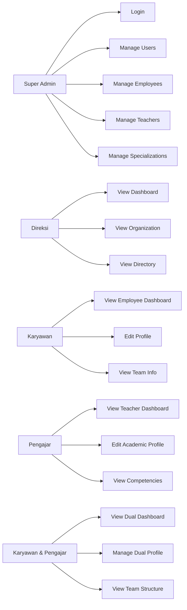

# Use Case Diagram

## Daftar Use Case Utama

### 1. Super Admin
- Login ke sistem
- Mengelola akun pengguna
- Mengelola data karyawan
- Mengelola data pengajar
- Mengelola data spesialisasi
- Melihat dashboard admin

### 2. Direksi
- Login ke sistem
- Melihat dashboard eksekutif
- Melihat struktur organisasi
- Melihat direktori karyawan
- Melihat direktori pengajar

### 3. Karyawan
- Login ke sistem
- Melihat dashboard karyawan
- Melihat profil kantor sendiri
- Mengedit biodata pribadi
- Melihat informasi atasan dan tim

### 4. Pengajar
- Login ke sistem
- Melihat dashboard pengajar
- Melihat profil akademik sendiri
- Mengedit biodata akademik
- Melihat kompetensi mengajar

### 5. Karyawan & Pengajar
- Login ke sistem
- Melihat dashboard gabungan
- Menjalankan backup data (Super Admin)
- Melihat log aktivitas seluruh user (Super Admin)
- Mengelola profil administratif
- Mengelola profil akademik
- Melihat kompetensi seni dan struktur tim

## Use Case Ringkas

